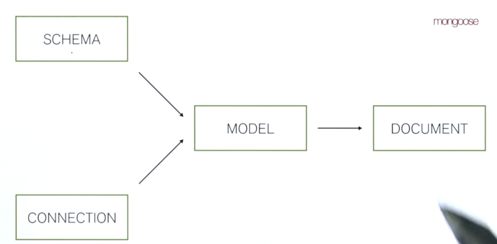

Moongose, object document object mapper for MongoDB. Provides schema validation, object validation and more features on top of the mongodb/Node.js drive.

4 primary data types:

- Schema: set of rules for documents (fields to have a document and which data type is each of them)
- Connection (represents 1 or more sockets connected to the mongodb server).
- Model (Combination of Schema & connection) - Wrapper around Mongodb collection and uses it's associated schema to make sure documents inserted into the collection satisfy the schema's constrains.
- Document - Can be though as an instatiation of a Model.

